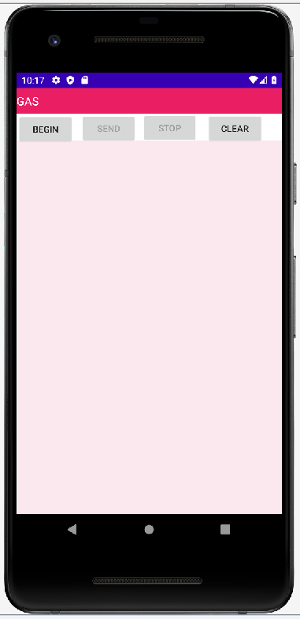

# GASAPP
GAS Android Application 

- Moe >>> I am using windows

## Setup
To start set up the environment, you need to install some IDE for the Andriod development:

-	Android Studio:
	 [Install here]( https://developer.android.com/studio/)
- 	To learn more about the environment here is a good viedo to start with:  [Click here]( https://www.youtube.com/watch?v=Ob4vSoWud9k)
		

## Initial Design Setup
The current or the first version is to test the following:
- Connecting devices
- Uploading data
- Sending commands
- Clearing data
- Visualizing data

The following is the first try:

 

	
	
